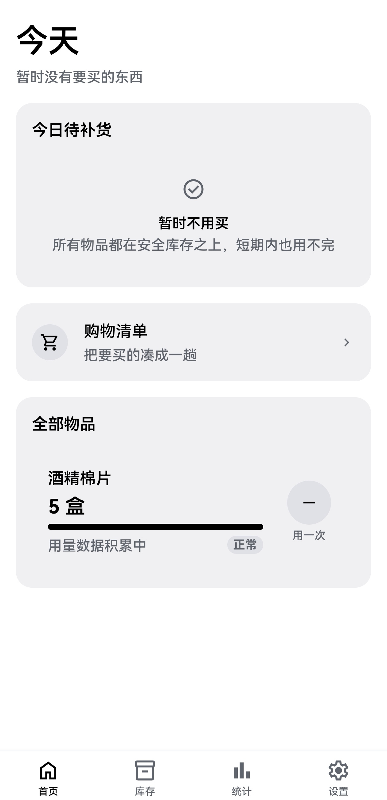
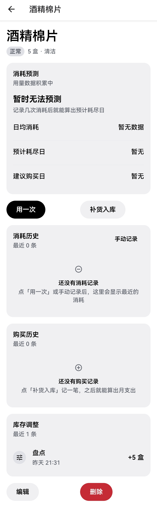
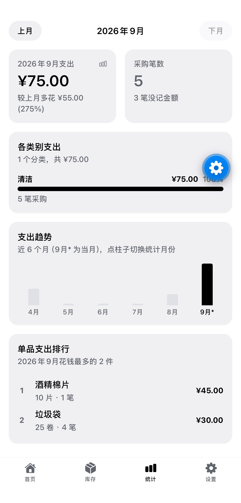
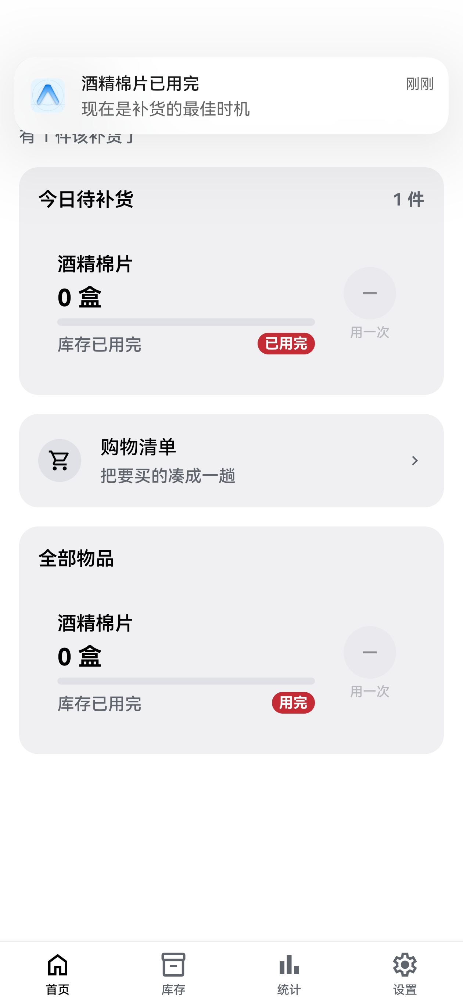

# 囤货管家（Restock Manager）

> 家庭消耗品智能补货提醒 App —— 记录家中消耗品的使用量与库存，预测耗尽时间，在合适的时间提醒你补货。

---

## 项目背景

家庭中大量物品是持续消耗的：纸巾、洗衣液、垃圾袋、宠物粮、饮用水……

这些物品有几个共同痛点：

- **不知道还剩多少**：用完了才发现，临时抓瞎
- **不知道什么时候该买**：没有时间预期，容易囤多或断货
- **重复购买**：买回来忘了记录，家人之间信息不同步
- **采购成本不透明**：不知道每月在这类物品上花了多少钱

**囤货管家**要解决的核心问题是：**用最低的记录成本，自动算出「什么时候该买」，并准时提醒。**

---

## 核心功能

| 模块 | 说明 |
|---|---|
| 物品管理 | 记录名称、分类、单位、库存、安全库存、提前提醒天数等 |
| 消耗记录 | 一键「用一次」快捷扣减，或手动输入数量 |
| 补货入库 | 记录购买数量、价格、日期，库存自动增加 |
| 智能预测 | 基于历史消耗计算日均消耗、预计耗尽日、建议购买日 |
| 补货提醒 | 每日摘要 + P0 紧急提醒双层通知机制 |
| 购物清单 | 自动汇总待补货物品，勾选已买/跳过 |
| 统计看板 | 月支出、分类占比、Top5 单品、近 6 个月趋势 |
| 备份恢复 | JSON 导出/导入，支持跨设备数据迁移 |

---

## 界面预览

| 首页 | 物品详情 |
|---|---|
|  |  |

| 购物清单 | 统计看板 |
|---|---|
|  |  |

---

## 产品设计思路

### 1. MVP 取舍

优先做「记录—预测—提醒」核心闭环，砍掉扫码识别、电商对接、多家庭共享等非核心功能，先验证产品价值。

### 2. 通知策略：及时触达 vs 不过度打扰

- **每日摘要**：合并所有待补货物品为一条通知，每天只发一次
- **P0 紧急提醒**：物品「已用完」时突破摘要，立即单独通知
- **冷却机制**：同一物品默认 3 天内不重复提醒
- **权限降级**：用户拒绝通知权限时，首页仍显示站内提醒条

### 3. 预测降级：冷启动方案

新物品没有消耗数据时，按用户填写的「预计使用周期」估算日均消耗；一旦有了真实流水，自动切换到实测统计。避免「新用户永远收不到提醒」的冷启动问题。

### 4. 数据模型：库存由流水重算

不直接修改库存字段，所有增减都通过流水记录（消耗/购买/调整/丢弃），库存由流水汇总得出。保证数据可追溯、可对账。

---

## 数据指标设计

| 指标 | 用途 |
|---|---|
| 日均消耗 | 预测剩余可用天数的基础 |
| 剩余可用天数 | 用户最关心的核心指标 |
| 预计耗尽日 | 计算建议购买日的依据 |
| 建议购买日 | 触发提醒的时间点 |
| 月支出 | 统计看板核心指标 |
| 分类支出占比 | 帮用户了解钱花在哪 |
| Top5 单品 | 识别高频消耗品 |

---

## 我的角色与贡献

作为独立开发者，完整负责从需求到上线的全流程：

- **需求分析**：从自身及家庭场景拆解痛点，定义 MVP 范围
- **产品设计**：输出 PRD，设计 9 大功能模块、6 张核心数据表
- **数据模型**：设计库存流水模型，保证可追溯、可对账
- **通知策略**：设计双层通知机制与冷却规则
- **开发实现**：借助 AI 编程工具完成全栈开发，独立解决数据库迁移、跨平台通知、事件冒泡等问题
- **测试验证**：编写 14 组冒烟测试，覆盖数据库迁移、通知调度、备份导入等关键路径

---

## 技术栈

- **前端**：React Native + Expo + TypeScript
- **路由**：Expo Router
- **数据库**：SQLite（本地优先，无远程依赖）
- **状态管理**：手写 Store + React Hooks
- **通知**：expo-notifications（本地通知）
- **构建**：EAS Build（云端构建 Android APK）

---

## 项目复盘

### 踩过的坑

1. **数据库迁移顺序错误**：种子数据在加列之前执行，导致首次安装就崩溃。后通过冒烟测试锁死迁移顺序。
2. **事件冒泡**：卡片内层按钮点击触发外层跳转。改用兄弟层级结构彻底解决。
3. **Web 打包失败**：Metro 缺 wasm 配置，导致 expo-sqlite 的 Web Worker 无法打包。

### 后续规划

- App 图标与品牌视觉
- 纯血鸿蒙（HarmonyOS NEXT）适配
- iOS 版本发布
- 家庭共享与多设备同步

---

## 项目状态

- ✅ 核心功能完整，真机可用
- ✅ 已打包为 Android APK，可在鸿蒙 4.2 及安卓设备安装
- ✅ 数据库迁移、通知调度、备份恢复均有自动化测试覆盖

---

*本项目为个人独立作品，用于验证「低记录成本 + 智能提醒」的补货管理方案。*
